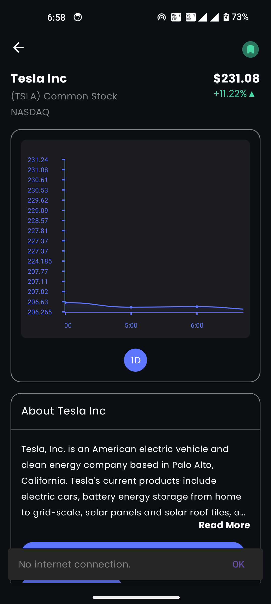

# Stock Info App

[Watch App Overview Video](https://drive.google.com/file/d/18BJJ-Bpao5YjYEumclnhpqHLVM-N0J1A/view?usp=sharing)<br/>

[Download APK](https://drive.google.com/file/d/1RHm6mAgU2dss24EvBtlHbTu5aOj09OZw/view?usp=sharing)

## Overview

The Stock Info App is a comprehensive tool for searching stock market related information. It provides real-time data on top gainers, top losers, and most traded stocks. The app also features a customizable watchlist, search functionality, and offline caching to ensure you have access to critical information even without an internet connection. Additionally, the app supports both dark mode and light mode for a seamless user experience.

## App Screenshots In Dark Mode


<p align="center">
  &nbsp;&nbsp;&nbsp;
  &nbsp;&nbsp;&nbsp;
  &nbsp;&nbsp;&nbsp;
  &nbsp;&nbsp;&nbsp;
  &nbsp;&nbsp;&nbsp;
  &nbsp;&nbsp;&nbsp;
  &nbsp;&nbsp;&nbsp;
  &nbsp;&nbsp;&nbsp;
  &nbsp;&nbsp;&nbsp;
  &nbsp;&nbsp;&nbsp;
  &nbsp;&nbsp;&nbsp;
  &nbsp;&nbsp;&nbsp;
  &nbsp;&nbsp;&nbsp;
  &nbsp;&nbsp;&nbsp;
  &nbsp;&nbsp;&nbsp;
  
</p>

## App Screenshots In Light Mode


<p align="center">
  &nbsp;&nbsp;&nbsp;
  &nbsp;&nbsp;&nbsp;
  &nbsp;&nbsp;&nbsp;
  &nbsp;&nbsp;&nbsp;
  &nbsp;&nbsp;&nbsp;
  &nbsp;&nbsp;&nbsp;
  &nbsp;&nbsp;&nbsp;
</p>


## Features

### Top Gainers
- View a list of stocks with the highest percentage price increase for the day.

### Top Losers
- View a list of stocks with the highest percentage price decrease for the day.

### Most Traded
- View a list of the most actively traded stocks.

### Company Overview
- View intraday graph of any stock.
- View detailed information on each stock including PE ratio, PB ratio, Market cap, Profit margin, dividend yield, etc.
- View previously seen company without internet with offline caching.

### Watchlist
- Create and manage a personalized list of stocks you want to monitor.
- Real-time updates on your watchlist stocks.

### Search
- Powerful search functionality to find information on any stock.
- Recent search history available offline.
- Catgorize search based upon the type (for eg: All, Stock, ETF and Mutual Fund).

### Offline Caching
- Recent searches, intraday graphs, top gainers, top losers, most traided and company overview are cached for offline access with a cache expiry of 30 min.

### Dark Mode and Light Mode
- Toggle between dark mode and light mode to suit your preferences

### Handling Loading/Error/Empty States

The app handles loading, error, and empty states for all cases to ensure a smooth user experience.

### Folder Structure

The app follows a standard, well-defined folder structure to maintain clean and maintainable code.

## Third Party Library Used
- Lottie Files
- YCharts
- Open CV
- Coil

## Getting Started

### Prerequisites
- Android Studio
- An Android device or emulator running Android 5.0 (Lollipop) or higher

### Installation

1. Clone the repository:
    ```bash
    git clone https://github.com/phinion8/StockInfo
    ```

2. Open the project in Android Studio.

3. Build and run the app on your device or emulator.


